# ArtGAN
Generating Abstract Art with Generative Adverserial Networks.

## Examples
### Cherry-picked
(Original) 64x64   
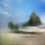

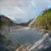

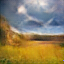
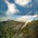
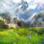
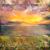
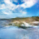

(Resized) 256x256  

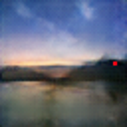
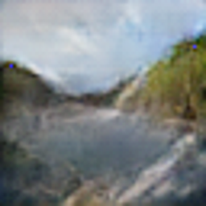
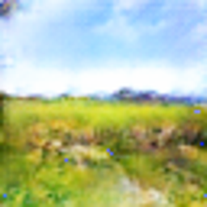
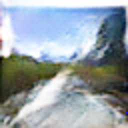
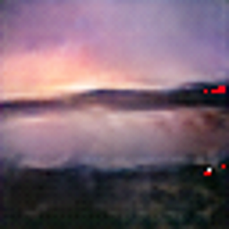
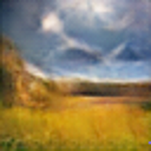

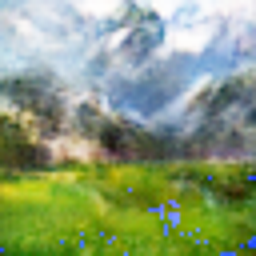
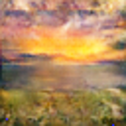

### Random (64)

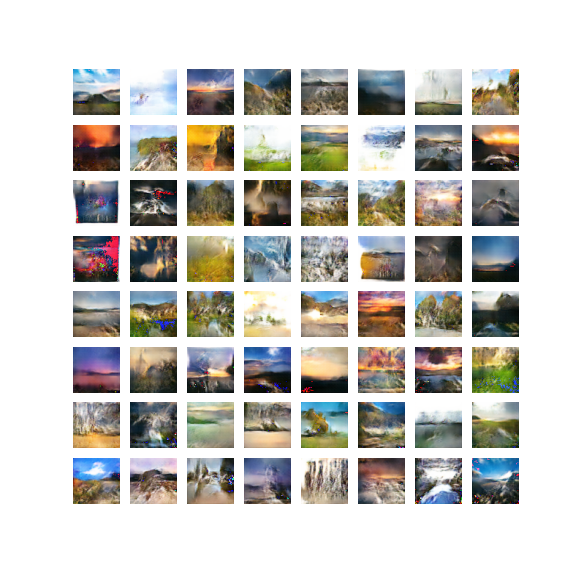
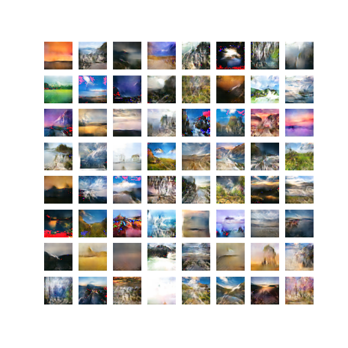
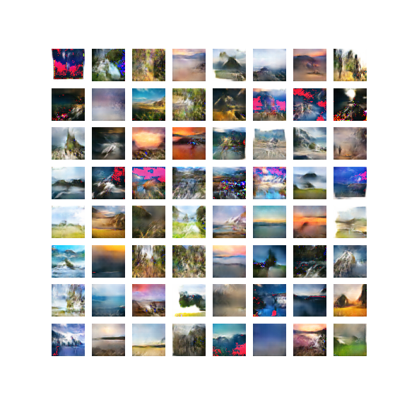

## Structure
I was using a standard DCGAN with an image size 64x64
Pre-trained models are stored in files GTrain.pt and DTrain.pt for Generator and Discriminator accordingly

## Dataset
I was using a Kaggle [dataset](https://www.kaggle.com/competitions/gan-getting-started/overview) consisting of 300 images of Monet's paintings and 7000 images of real photos.